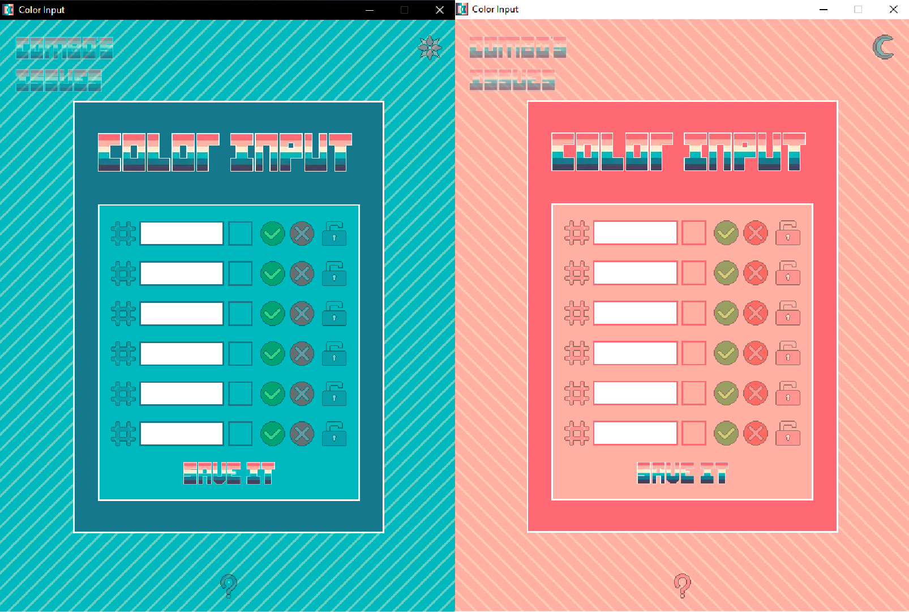

# Color Input (Desktop Window)

* bad architecture - stil not scalable
* bad expirience of using Electron

----
- [ ] not using Notification of Electron
- [ ] not using Shortcuts of Electron
- [ ] not using multi-windows of Electron
- [x] using 'nativeTheme' module of Electron + SCSS @media(prefers-color-scheme)
- [ ] was NOT able to attach user's icons for Application (hate Electron)
